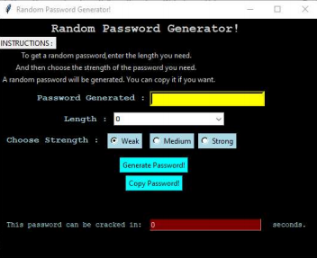
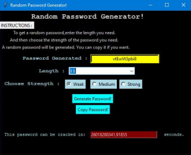

# Random Password Generator
## Introduction to the Application
Remember that you store a lot of sensitive information you would not like to get stolen from your account. The first line of defence from unauthorized access to your computer and personal information is provided by passwords. As your password strengthens, your computer is more protected from hackers and malicious software. Paying attention to your password is therefore essential. 

The application is a simple, entirely **offline random password generator**, which gives you the required password and also prevents the same from being intercepted. It also tells about the **hack time** of the password to let one know how strong is the password generated.

The app can generate random passwords with letters, numeric and special characters. The required **length** and the **strength** of the password can be specified by the user.

## How is the strength of the password determined?
| S.No. | Level | Level value | No. of upper case | No. of digits | No. of special characters | No. of lower case | 
| ----------- | ----------- |----------- | ----------- |----------- | ----------- |----------- | 
|1 | Weak |0 | 2 |2 | 0 |length-4 |
| 2 | Medium |1 | 2 |2 | 2 |length-6 |
| 3 | Strong |2 | 4 |4 | 2 |length-10 |

## Screenshots of the Game

#### Final Layout of the game

#### Sample Output

